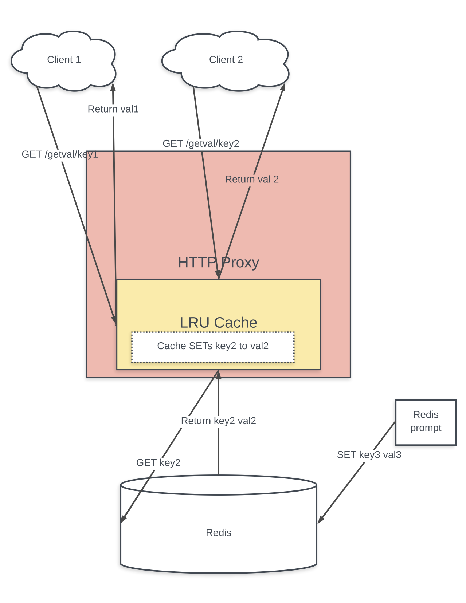

# redis-proxy

### High-level architecture overview

### What the code does
The code spins up an HTTP proxy that runs a read-through cache and connects to a single-instance "backing Redis." 
A GET request to the proxy returns the value of the specified key from the proxy’s local cache if the local cache contains a value for that key. Otherwise, the proxy fetches the value from Redis, via the Redis GET command, and stores it in the local cache, associated with the specified key. If the key/value cannot be found, the proxy returns an empty string.

Any writes to the Redis instance bypass the proxy. In this case, you need to open an interactive Redis session (see **Session 3** below) to write to Redis.

The system is run entirely in two docker containers. One container runs the proxy. The other container serves as the Redis instance.

The proxy is written in Go (allowing multiple clients to concurrently connect to it and have their requests sequentially processed) but because the environment is containerized, you need have only docker, docker-compose, and a Bash terminal to run the code.

### Algorithmic complexity of the cache operations
//////// DOUBLE-CHECK ME ///////
getCVal retrieves the key's value from the local cache ==> Complexity: O(1)
setCVal adds a key/value to the cache ==> Complexity: O(1)
### How to run the proxy and tests

#### Getting started (Single-click build and test)
Open a terminal session and run:

    git clone git@github.com:jeveleth/redis-proxy.git
    cd redis-proxy
    make test # Build the proxy and run the tests

#### Running your own proxy
(This assumes you have cloned the repo and are in the top-level directory of the project.)

        make docker-proxy # Start interactive session with proxy docker container
        ./proxy -help     # Returns configurable flags
        ./proxy           # To run the proxy (flags are optional)

 You can run the service by opening three terminal sessions and doing as follows:
* (In **Session 1**)

        make docker-proxy         # Start interactive session with proxy docker container
        ./proxy -proxy-port 9000  # Run proxy on port 9000

* (In **Session 2**)

        make docker-proxy                # Start interactive session with proxy docker container
        curl localhost:9000/getval/key22 # Get the value (if any) for key22

    You should *not* see any value.

* (In **Session 3**)

        make redis-cli     # Start interactive session with the redis server.
        set key22 value22. # Set a value in redis server.

    Go back to **Session 2**. Run the curl command twice and see a response first from Redis, then from the local cache.

        curl localhost:9000/getval/key22  # Run this.
        From Redis: key22 => value22.     # Proxy responds with value from redis
        curl localhost:9000/getval/key22  # Run this.
        From cache: key22 => value1.      # Proxy responds with value from cache

#### Running the tests

        make docker-proxy # start interactive session with proxy container.
        go test -v # run the tests.

### How long you spent on each part of the project.
* HTTP web service (1 hr)
* Single backing instance (2 hrs)
* Cached GET (2 hrs)
* System tests (3 hrs)
* Platform (2 hrs)
* Single-click build and test (1hr)
* LRU eviction and fixed key size (30 min)
* Global expiry (30 min)
* Documentation (3 hrs) 

#### A list of the requirements that you did not implement and the reasons for omitting them.
* Sequential concurrent processing (Confused about setting max connections on server)
* Parallel concurrent processing (Ran out of time)
* Redis client protocol (Ran out of time)

 <!-- TODO -->
Sequential concurrent processing
Multiple clients are able to concurrently connect to the proxy (up to some configurable maximum limit) without adversely impacting the functional behaviour of the proxy. When multiple clients make concurrent requests to the proxy, it is acceptable for them to be processed sequentially (i.e. a request from the second only starts processing after the first request has completed and a response has been returned to the first client).

Bonus Requirements
The requirements below add some additional complexity to the design and can be implemented as a bonus. However, we strongly encourage candidates who are applying for a role which has a strong backend systems focus to implement these as well.

Parallel concurrent processing
Multiple clients are able to concurrently connect to the proxy (up to some configurable maximum limit) without adversely
impacting the functional behaviour of the proxy. When multiple clients make concurrent requests to the proxy, it would execute a number of these requests (up to some configurable limit) in parallel (i.e. in a way so that one request does not have to wait for another one to complete before it starts processing).

Redis client protocol
Clients interface to the Redis proxy through a subset of the Redis protocol (as opposed to using the HTTP protocol). The proxy should implement the parts of the Redis protocol that is required to meet this specification.
